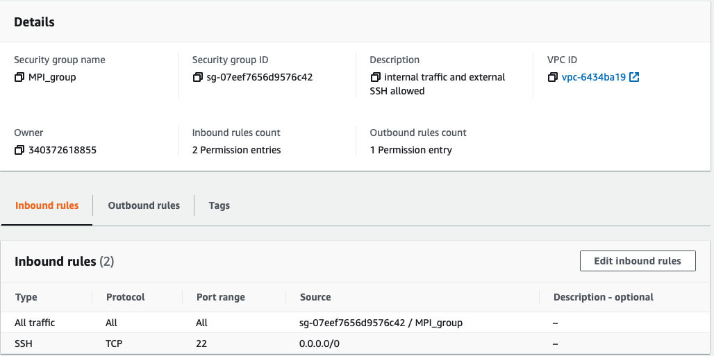
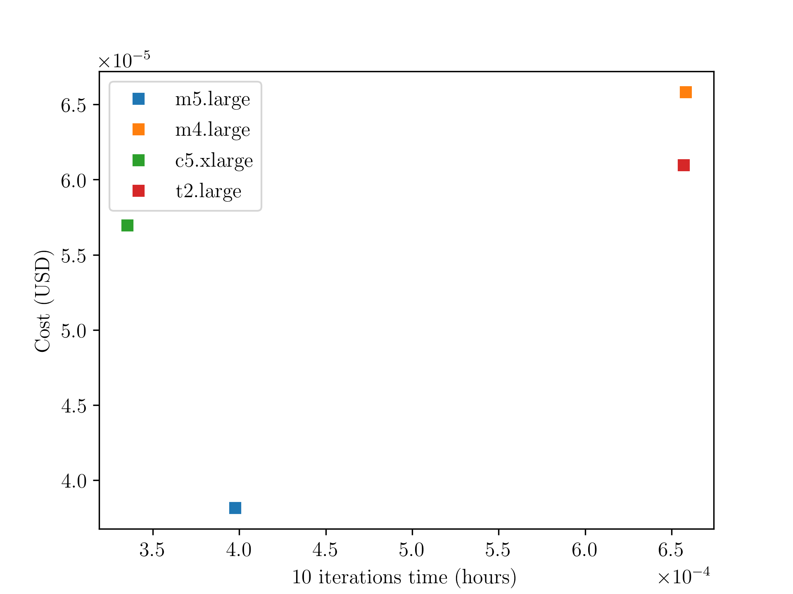

# Passos necessários para execução do experimento

## 1) Escolhendo a imagem da máquina

Escolheu-se a imagem "Ubuntu Server 20.04 LTS (HVM), SSD Volume Type" como mostrado na figura abaixo.


Figura 1. Imagem utilizada nos experimentos.

## 2) Escolhendo o tipo da instância

No experimento foram usadas as intâncias: "c5.large", "m5.large", "m4.large", "m4.xlarge", "t2.large"

## 3) Configurar detalhes da instância

Todas as instâncias foram configuradas de acordo com as imagens abaixo, onde-se utilizou 4 instâncias em cada experimento. A opção "add instance to placement group" foi selecionada para tirar proveito de uma rede como melhor desempenho. Para instalar os pacotes necessários nas máquina para realização dos experimentos, na opção "User Data", foi adicionado o seguinte texto:

```
#!/bin/bash
sudo apt-get update
sudo apt-get install -y \
    apt-transport-https \
    ca-certificates \
    curl \ 
    gnupg \
    lsb-release
curl -fsSL https://download.docker.com/linux/ubuntu/gpg | sudo gpg --dearmor -o /usr/share/keyrings/docker-archive-keyring.gpg
echo \
  "deb [arch=amd64 signed-by=/usr/share/keyrings/docker-archive-keyring.gpg] https://download.docker.com/linux/ubuntu \
  $(lsb_release -cs) stable" | sudo tee /etc/apt/sources.list.d/docker.list > /dev/null
sudo apt-get update
sudo apt-get install -y docker-ce docker-ce-cli containerd.io
```


Figura 2. Detalhes da configuração da instância, parte 1.


Figura 3. Detalhes da configuração da instância, parte 2.

## 4) Adicionando o dispostivo de armazenamento

Definiu-se um storage com 16 GB do tipo "General Purpose SSD (gp2)", como mostrado na imagem abaixo.


Figura 4. Configuração do storage utilizado nos experimentos.

## 5) Configurando o grupo de segurança

Configurou-se as regras de acesso as máquinas virtuais como mostrado nas imagens abaixo. Para que ocorra comunicação entre as máquinas é necessária a criação de um "security group", que é configurado de acordo com as imagens abaixo.


Figura 5. Configuração do grupo de segurança usado nos experimentos.


Figura 6. Detalhes das regras de entrada do grupo de segurança.


Figura 7. Detalhes das regras de saída do grupo de segurança.

## 6) Acesso as máquinas virtuais e execução da aplicação

Para cada experimento, as 4 máquinas virtuais são acessadas na máquina local via SSH utilizando um terminal para cada instância. Uma dessas quatro instâncias será a master, onde será necessário obter o seu número do "Private IPv4 addresses". Em cada máquina é necessário a instalação da aplicação DCGAN, para isso é necessário rodar o script "scipt.sh" presente na "pasta ativ-7-exp-1". Após esse passo, para executar a aplicação, utiliza-se o seguinte comando em cada terminal:

```
sudo docker run --env OMP_NUM_THREADS=1 --rm --network=host -p 1234:1234 -v=$(pwd):/root dist_dcgan:latest python -m torch.distributed.launch --nproc_per_node=1 --nnodes=4 --node_rank=0 --master_addr="ip_master" --master_port=1234 dist_dcgan.py --dataset cifar10 --dataroot ./cifar10 --num_epochs 1 --batch_size 32 --max_workers 1
```

Onde, altera-se o número do "--node_rank" para em terminal, lembrando que o master tem rank igual a zero. No parâmetro "--master_add" deve ser inserido o "Private IPv4 addresses" do master.

# Resultados

Primeiramente, o objetivo deste experimento é entender o custo benefício da execução de uma aplicação paralela na nuvem computacional. Desse modo, executou-se a aplicação DCGAN em tipos de máquinas virtuais diferentes. Escolheu-se as seguintes máquinas: "c5.large", "m5.large", "m4.large", "m4.xlarge", "t2.large". Onde, as configurações das máquinas são apresentadas na imagem abaixo.


Figura 8. Detalhes das máquinas virtuais utilizadas nos experimentos.


Figura 9. Custo de uma máquina para realização de uma "epoch".


Figura 10. Custo de uma máquina para realização de uma iteração.


Figura 11. Custo de uma máquina para realização de duas iterações.


Figura 12. Custo de uma máquina para realização de dez iterações.
