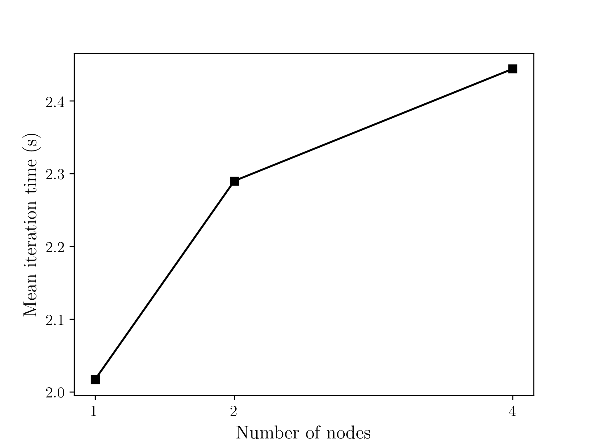

# Passos necessários para execução do experimento

O objetivo deste experimento é entender o processo de automação de provisionamento e configuração de aplicações na nuvem utilizando as ferramentas Ansible (https://www.ansible.com) e CLAP (https://clap.readthedocs.io/en/latest/index.html). Para os experimentos, utilizou-se a aplicação DCGAN (https://github.com/hugolui/Distributed-DCGAN).

## 1) Instalação das ferramentas

Os passos para instalação do CLAP e Ansible são detalhados em https://clap.readthedocs.io/en/latest/introduction.html.

## 2) Configuração do provedor na nuvem

No arquivo "./clap/configs/providers.yaml" é definido o provedor, as chaves de acesso e a região. A configuração utilizada nesse experimento é apresentada abaixo. 


Figura 1. Configuração do provedor na nuvem utilizada nos experimentos.

## 3) Configuração de login

No arquivo "./clap/configs/logins.yaml" é definido as informações necessárias para o acesso das máquinas virtuais via SSH. A configuração utilizada nesse experimento é apresentada abaixo.


Figura 2. Configuração de login utilizada nos experimentos.

## 4) Configuração de template das instâncias

No arquivo "./clap/configs/instances.yaml" é definido as informações sobre a máquina virtual, como tipo de instância, tipo da imagem, tamanho do disco, grupo de segurança e entre outros. Detalhes sobre a criação do "security group" podem ser obtidos em (https://github.com/hugolui/Distributed-DCGAN/blob/ativ-7-exp-1/experiments/ativ-7-exp-1/README.md), na seção 5.


Figura 3. Configuração de template das instâncias.

## 5) Configuração do cluster

Três configurações de cluster foram utilizadas nos experimentos. As configurações de cada cluster estão presentes na pasta "/clap/configs/clusters/".
* Uma máquina t2.small (cluster-t2_small-1x.yml)
* Duas máquinas t2.small (cluster-t2_small-2x.yml)
* Quatro máquinas t2.small (cluster-t2_small-4x.yml)

A estrutura do arquivo cluster-t2_small-xx.yml é ilustrada abaixo. Para mudar o número de máquinas no cluster é necessário modificar o parâmetro "args" da ação dentro da configuração "setup-run", onde esse número indica o quantidade de máquinas a serem criadas. Além disso, é necessário modificar o parâmetro "count" dos "slave-nodes" dentro da opção "node", onde essse número indica a quantidade de "slave nodes" (número de máquinas - 1). Nota-se também que é preciso ter atenção ao caminho dos diretórios presentes nas configurações: "setup-get-ip", "setup-send-ip", "setup-fetch" e "setup-fetch-png".

```
setups:

  ### Get master ip number ###
  setup-ip-master:
    roles:
    - name: gan

    actions:
    - role: gan
      action: run-script
      extra:
        src: ip_master.sh
        args: "0"

  ### Get slave ip numbers ####
  setup-ip-slave:
    roles:
    - name: gan

    actions:
    - role: gan
      action: run-script
      extra:
        src: ip_slave.sh
        args: "0"

  ### Download each IP number from remote machines ###      
  setup-get-ip:
    roles:
    - name: gan

    actions:
    - role: gan
      action: fetch
      extra:
        src: ~/172*
        dest: ~/Desktop/MO833/atividade8/t2_small_4x/

  ### Send all ip numbers and ip code to nodes ###      
  setup-send-ip:
    roles:
    - name: gan

    actions:
    - role: gan
      action: copy
      extra:
        src: ~/Desktop/MO833/atividade8/t2_small_4x/
        dest: ~/

  ### Install Docker and DCGAN ###
  setup-gan:
    roles:
    - name: gan

    actions:
    - role: gan
      action: run-script
      extra:
        src: setup.sh
        args: "0"

  ### Run DCGAN on all nodes ####      
  setup-run:
    roles:
    - name: gan

    actions:
    - role: gan
      action: run-script
      extra:
        src: run.sh
        args: "4" # Total number of nodes (master + slaves)

  ### Download output files from remote to local###
  setup-fetch:
    roles:
    - name: gan

    actions:
    - role: gan
      action: fetch
      extra:
        src: ~/Distributed-DCGAN/ip-*
        dest: ~/Desktop/MO833/atividade8/t2_small_4x/

  setup-fetch-png:
    roles:
    - name: gan

    actions:
    - role: gan
      action: fetch
      extra:
        src: ~/Distributed-DCGAN/*.png
        dest: ~/Desktop/MO833/atividade8/t2_small_4x/


### Cluster t2.small ###
clusters:
  t2_small:

    # These setups are executed at all cluster's nodes, after setups at nodes section
    after_all:
    - setup-send-ip
    - setup-gan
    - setup-run
    - setup-fetch
    - setup-fetch-png

    nodes:
      master-node:
        type: t2_small-ubuntu20-16gb-mpi_group
        count: 1 # Number of master nodes
        setups:
        - setup-ip-master
        - setup-get-ip

      slave-nodes:
        type: t2_small-ubuntu20-16gb-mpi_group  
        count: 3  # Number of slave nodes
        min_count: 0
        setups:                      
        - setup-ip-slave
        - setup-get-ip
```
Resumidamente, neste arquivo de configuração é definido:
* Número de máquinas do cluster ("master" e "slaves")
* Obtenção do IP de cada máquina virtual
* Download do IP de cada máquina virtual
* Distribuição de todos os IPs para cada máquinas virtual, além do código que rotula cada máquina virtual com um "rank", que é utilizado no comando para rodar a aplicação.
* Download e instalação da aplicação e dos pacotes em cada máquina virtual
* Execução da aplicação em paralelo
* Download dos arquivos de saida presente em cada máquina virtual para a máquina local.

Os arquivos de script e python necessários para executar os experimentos estão presentes na pasta "/clap/roles/roles/files/". 

## 6) Criação do cluster

Primeiramente, para o uso do Clap é necessário ativar o ambiente virtual. Dentro do diretório "clap", obtido pelo github, utiliza-se o seguinte comando: 
```
source clap-env/bin/activate
```

Após esse passo, a criação do cluster é realizada a partir do seguinte comando:
* Para um cluster com uma máquina
```
clapp cluster start t2_small_1x             
```
* Para um cluster com duas máquinas
```
clapp cluster start t2_small_2x             
```

* Para um cluster com quatros máquinas
```
clapp cluster start t2_small_4x             
```

## 7) Resultados



Figura 4. Tempo de iteração para cada tipo de cluster.

O tempo de iteração médio da aplicação para cada tipo de cluster é apresentado na Fig. 1. Observa-se que ao aumentar o número de máquinas do cluster, o tempo de iteração médio sobe. Este resultado não era o esperado, provavelmente algum problema de comunicação aconteceu entre as máquinas virtuais. De acordo com AWS, a máquina "t2.small" tem uma perfomance de rede de baixa a moderada, isso pode ser um explicação. Outra possível causa pode estar relacionada a configuração do "placemente group", neste experimentou utilizou-se a estratégia "spread".  

