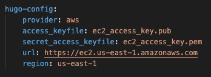
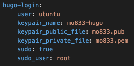
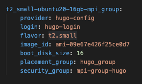

# Passos necessários para execução do experimento

O objetivo deste experimento é entender o processo de automação de provisionamento e configuração de aplicações na nuvem utilizando as ferramentas ANSIBLE e CLAP.

## 1) Configuração do provedor na nuvem

No arquivo "./clap/configs/providers.yaml" é definido o provedor, as chaves de acesso e a região. A configuração utilizada nesse experimento é apresentada abaixo. 

Figura 1. Configuração do provedor na nuvem utilizada nos experimentos.

## 2) Configuração de login

No arquivo "./clap/configs/logins.yaml" é definido as informações necessárias para o acesso das máquinas virtuais via SSH. A configuração utilizada nesse experimento é apresentada abaixo.

Figura 2. Configuração de login utilizada nos experimentos.

## 3) Configuração de template das instâncias

No arquivo "./clap/configs/instances.yaml" é definido as informações sobre a máquina virtual, como tipo de instância, tipo da imagem, tamanho do disco, grupo de segurança e entre outros.  

Figura 3. Configuração de template das instâncias.

